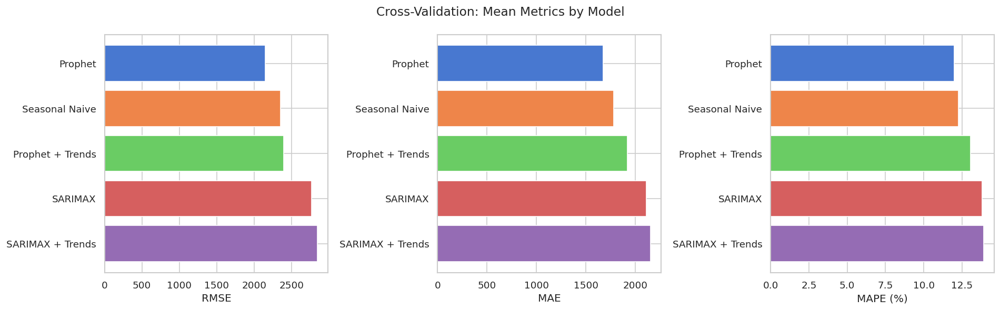
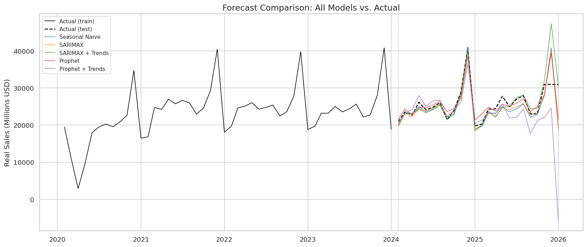

# Fashion Retail Demand Forecasting

Do Google Trends signals for fashion search terms improve forecasts of monthly US clothing retail sales?

This project compares five time series forecasting models (with and without Google Trends as exogenous regressors) using 20+ years of government economic data and rolling-window cross-validation.

## Project Structure

```
fashion-demand-forecast/
├── .github/workflows/ci.yml      # Lint + test on push/PR
├── .gitignore
├── .env.example                   # FRED_API_KEY template
├── pyproject.toml                 # pytest + ruff config
├── requirements.txt
├── data/
│   ├── raw/
│   │   ├── clothing_sales.csv     # fetched from FRED API
│   │   ├── cpi_apparel.csv        # fetched from FRED API
│   │   └── google_trends/         # manually exported CSVs
│   └── processed/
├── src/
│   ├── config.py                  # Constants and parameters
│   ├── data_loader.py             # FRED API + Trends CSV parsing
│   ├── preprocessing.py           # Merge, deflate, stationarity
│   ├── models.py                  # SeasonalNaive, SARIMAX, Prophet
│   └── evaluation.py              # Metrics + rolling-window CV
├── tests/                         # 29 tests, all CI-safe
├── notebooks/
│   └── analysis.ipynb             # Full analysis notebook
└── results/
    ├── figures/                   # Generated charts
    └── metrics.json               # Model comparison metrics
```

## Data Sources

| Source | Series | Description | Frequency |
|--------|--------|-------------|-----------|
| [FRED](https://fred.stlouisfed.org/) | MRTSSM448USN | US clothing retail sales (nominal, not seasonally adjusted) | Monthly, 1992-present |
| [FRED](https://fred.stlouisfed.org/) | CPIAPPNS | CPI Apparel index (for inflation adjustment) | Monthly |
| [Google Trends](https://trends.google.com/) | 6 fashion terms | Relative search interest (0-100) | Monthly, 2004-present |

**Google Trends terms:** fast fashion, luxury fashion, sustainable fashion, couture, secondhand fashion, discount fashion. Each represents a distinct fashion market segment (production, price point, or distribution model).

Nominal sales are deflated to real (inflation-adjusted) dollars using the CPI Apparel index before modeling.

## Models

| Model | Type | Uses Google Trends? | Description |
|-------|------|---------------------|-------------|
| Seasonal Naive | Baseline | No | Predict each month as its value from last year |
| SARIMAX | Statistical | No | Seasonal ARIMA with (1,1,1)(1,1,1,12) order |
| SARIMAX + Trends | Statistical | Yes | Same SARIMAX with Trends as exogenous regressors |
| Prophet | Bayesian | No | Facebook Prophet with yearly seasonality + US holidays |
| Prophet + Trends | Bayesian | Yes | Prophet with Trends as additional regressors |

The with/without Trends comparison is the core of the analysis. Comparing each model against its Trends-augmented variant isolates the contribution of search interest data.

## Results

### Cross-Validation (12 folds, 12-month horizon)

| Model | Mean RMSE | Mean MAE | Mean MAPE (%) |
|-------|-----------|----------|---------------|
| **Prophet** | **2,145** | **1,676** | **12.0** |
| Seasonal Naive | 2,351 | 1,779 | 12.3 |
| Prophet + Trends | 2,391 | 1,920 | 13.1 |
| SARIMAX | 2,770 | 2,110 | 13.8 |
| SARIMAX + Trends | 2,844 | 2,152 | 13.9 |

### Key Findings

**Google Trends did not improve forecast accuracy.** Adding fashion search interest as exogenous regressors slightly degraded both SARIMAX and Prophet:

- SARIMAX + Trends: +2.7% worse RMSE vs. SARIMAX alone
- Prophet + Trends: +11.5% worse RMSE vs. Prophet alone

The best model was **Prophet without Trends** (mean CV RMSE = 2,145), followed by the Seasonal Naive baseline. The strong seasonal pattern in clothing retail sales is the dominant signal; monthly search interest for fashion market segments does not add predictive value at this aggregation level.





## Cross-Validation Design

Rolling-window cross-validation with:
- **10-year** initial training window
- **12-month** forecast horizon per fold
- **1-year** step between folds

This produces 12 train/test splits across different time periods (including the COVID-19 crash), giving a more robust evaluation than a single holdout split.

## Setup

1. Clone the repository:
   ```bash
   git clone https://github.com/mtsdrury/fashion-demand-forecast.git
   cd fashion-demand-forecast
   ```

2. Install dependencies:
   ```bash
   pip install -r requirements.txt
   ```

3. Get a free FRED API key from [fred.stlouisfed.org](https://fred.stlouisfed.org/docs/api/api_key.html), then:
   ```bash
   cp .env.example .env
   # Edit .env and add your FRED_API_KEY
   ```

4. Download Google Trends CSVs (see `data/raw/google_trends/README.md` for instructions).

5. Run the analysis notebook:
   ```bash
   jupyter notebook notebooks/analysis.ipynb
   ```

## Tests

All 29 tests run without API keys or external data (CI-safe):

```bash
pytest tests/ -v
ruff check src/ tests/
```

## Key Design Decisions

- **Real (inflation-adjusted) sales as the target.** Nominal sales include price inflation, which would bias forecasts upward. Deflating with CPI Apparel isolates real demand changes.
- **Rolling-window CV over a single train/test split.** A single split is sensitive to where you cut; rolling windows evaluate performance across multiple time periods, including structural breaks like COVID.
- **Manual Google Trends exports over pytrends.** The pytrends library was archived in April 2025 and had chronic rate-limiting issues. Manual CSV export is reliable, and the files are small enough to check into version control.
- **Lazy Prophet import.** Prophet is imported inside the class method rather than at module level, so tests that only exercise SeasonalNaive or SARIMAX don't require Prophet to be installed.

## Tools and Libraries

Python, pandas, NumPy, statsmodels, Prophet, fredapi, scikit-learn, Matplotlib, Seaborn, pytest, ruff, GitHub Actions
